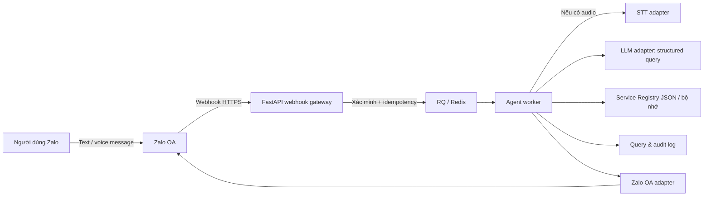
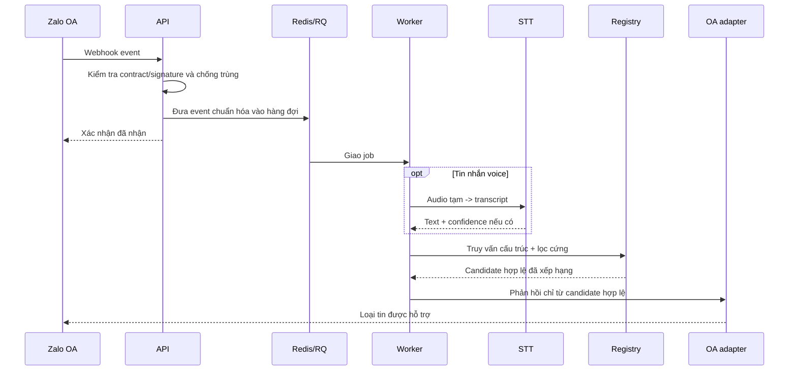

# Tổng quan kiến trúc mục tiêu của MVP

## Trạng thái local MVP

Luồng text local đã chạy qua `POST /demo/query` hoặc Redis/RQ qua
`POST /demo/queue`: rule-based intent extraction, registry JSON trong bộ nhớ,
hard filter, ranking, URL allowlist và response finalization. Readiness hiện
probe Redis và registry được validate fail-fast khi app/worker dựng pipeline.

Webhook Zalo vẫn cố ý trả `501 ZALO_CONTRACT_NOT_CONFIGURED`. Signature,
idempotency, Zalo send-message, provider LLM/STT thật và xử lý audio vẫn phải
được hoàn thiện trước khi bật OA hoặc dữ liệu thật. Dữ liệu trong `data/demo/`
chỉ là fixture local.

## Bối cảnh và phạm vi

Zalo AI Service Navigator là một trợ lý triển khai dưới dạng Zalo Official Account (OA). MVP nhận text hoặc voice message, chuyển voice thành text khi cần, trích xuất nhu cầu có cấu trúc, tìm trong Service Registry do nhóm kiểm soát và trả tối đa ba lựa chọn hợp lệ.

MVP **không** tìm toàn bộ OA/Mini App trên Zalo, không tự đặt lịch/thanh toán và không để mô hình ngôn ngữ tự tạo tên dịch vụ hoặc URL. Bốn nhóm dữ liệu ban đầu là y tế, điện/nước/tiện ích, giáo dục và giao thông/dịch vụ công.

Stack được chọn cho scaffold:

- FastAPI cho HTTP API và webhook gateway.
- RQ trên Redis cho hàng đợi công việc.
- File JSON được review và nạp vào bộ nhớ cho Service Registry 20-40 record.
- Adapter thay thế được cho Zalo OA, LLM và STT.

## Sơ đồ thành phần mục tiêu



Webhook chỉ xác minh, chuẩn hóa envelope, kiểm tra idempotency và enqueue. STT, LLM, search và gửi phản hồi chạy ở worker để webhook có thể acknowledge sớm sau khi event hợp lệ được ghi nhận.

## Ranh giới module

Toàn bộ mã ứng dụng nằm trực tiếp dưới `src/` theo cấu trúc phẳng, tương ứng với các khối mà nhóm cần làm:

```text
main.py / api / worker
          |
          v
        skills
          |
          v
domain + llm + voice + zalo
```

- `api`: route health và webhook; không chứa thuật toán search hay prompt.
- `worker`: RQ jobs và wiring; không chứa nghiệp vụ riêng.
- `skills`: điều phối text/voice, clarification, search và response policy.
- `domain`: model, registry JSON, search, URL policy, audit và privacy.
- `llm`: schema/client cho provider LLM.
- `voice`: tải tạm, gọi STT, confidence flow và cleanup theo retention.
- `zalo`: xác minh webhook và gửi phản hồi qua Zalo OA.
- `config.py` và `main.py`: cấu hình cùng FastAPI entrypoint tối thiểu.

`domain` không phụ thuộc trực tiếp SDK của provider. API/worker chỉ gọi interface trong module tương ứng để test có thể dùng fake adapter mà không cần secret hoặc network.

## Luồng text và voice



Chi tiết signature, event name, trường audio, endpoint gửi tin và token lifecycle chưa được giả định trong sơ đồ. Chúng chỉ được hiện thực sau khi hoàn tất [checklist Zalo](../integrations/zalo-checklist.md).

## Tìm kiếm và quyền quyết định

Pipeline bám theo plan:

1. Chuẩn hóa lỗi chính tả, tên địa phương và alias.
2. Lọc cứng theo `active`, category và vùng khi có.
3. Keyword search trên tên, alias, mô tả và intent trong registry bộ nhớ.
4. Tính điểm rule-based; có thể rerank một tập ứng viên nhỏ.
5. Kiểm tra URL theo allowlist trước khi tạo phản hồi.

Full-text nâng cao, PostgreSQL/pgvector và vector search chỉ được xem xét khi registry/traffic vượt phạm vi hackathon; chúng không thuộc runtime hiện tại.

Mô hình ngôn ngữ chỉ được phép trả structured query và diễn đạt kết quả do backend cung cấp. Registry/search backend là thành phần duy nhất quyết định service ID và launch URL nào có thể xuất hiện.

## Dữ liệu tối thiểu

Registry JSON cần biểu diễn ít nhất:

- `service`: tên, provider, loại dịch vụ, category, mô tả, vùng, target user, launch URL, `active`, `owner`, `last_verified_at` và priority.
- `service_alias`: các cách gọi đời thường, viết tắt hoặc lỗi phát âm.
- `service_intent`: intent và example query.

Audit runtime mục tiêu là cấu trúc riêng, không nằm trong file registry: message/event correlation ID, UID đã giảm thiểu hoặc hash, query chuẩn hóa, intent, lựa chọn và confidence. Persistence audit bền vững chưa thuộc scaffold hiện tại.

Audio là dữ liệu tạm thời, không phải dữ liệu registry. Thời hạn lưu, nơi lưu và cơ chế xóa phải được chốt trước khi bật voice thật.

## Độ tin cậy và bảo mật bắt buộc

- HTTPS và xác minh webhook theo contract Zalo hiện hành.
- Idempotency theo định danh event/message đã xác minh.
- Token/secret chỉ qua biến môi trường hoặc secret manager; không ghi log.
- Retry có giới hạn, backoff và nơi cách ly failed jobs để tránh vòng lặp.
- Hash/giảm thiểu UID trong analytics; cấu hình retention cho audio/log.
- URL allowlist, schema validation và tách system policy khỏi input người dùng.
- Timeout/circuit-breaker hợp lý cho LLM, STT và OA API; fallback rõ ràng.

## Observability và tiêu chí nghiệm thu

Mỗi flow cần correlation ID xuyên suốt API, queue và worker. Theo dõi tối thiểu webhook latency, queue lag, STT/LLM latency, lỗi OA API, invalid signature, duplicate event, URL bị chặn và fallback.

Chất lượng sản phẩm được đo bằng intent accuracy, slot extraction F1, Recall@3, Top-1 accuracy, no-result/clarification rate, median/P95 latency, STT success/confirm-again rate và click/select rate. Ngưỡng mục tiêu vẫn là quyết định cần chốt; không hard-code một ngưỡng không có chủ sở hữu.
